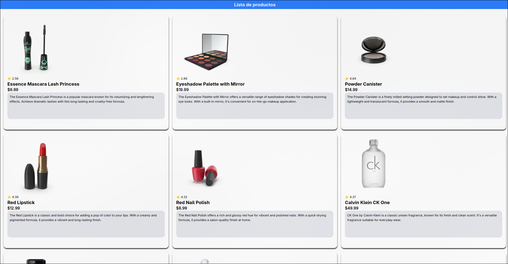

# React_Query_Example1



## TechStack

<div style="diplay:none">


</div>

## Description
Este es un repositorio sencillo donde aplicamos el uso de TankStack/React-Query
el cual nos ayuda con el fetching de los datos de una API, lo cual nos permite
tener un mejor manejo de las peticiones HTTP

## To use this repository

> Clone this repository
````
```
  cd app
  npm install
  npm run start
```
